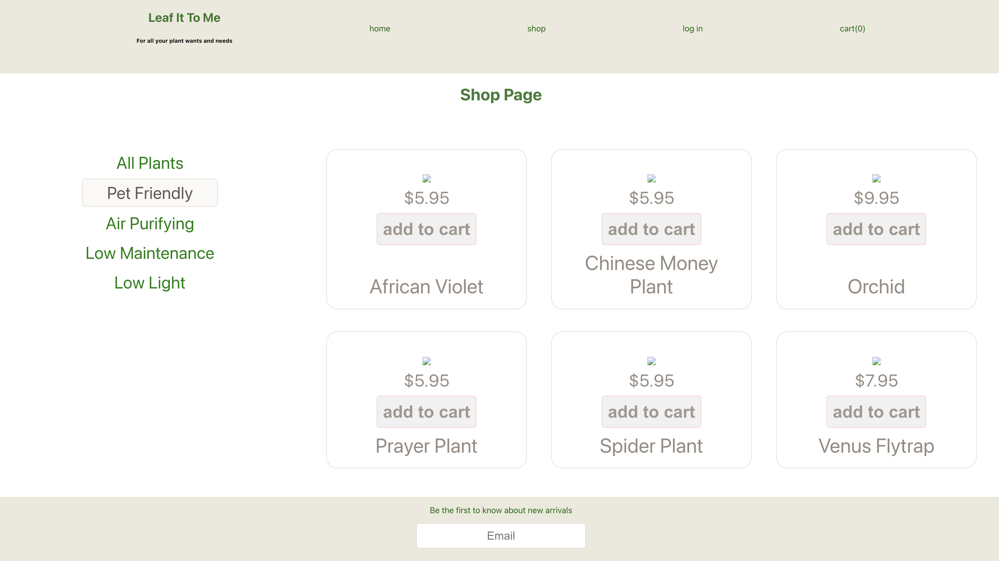
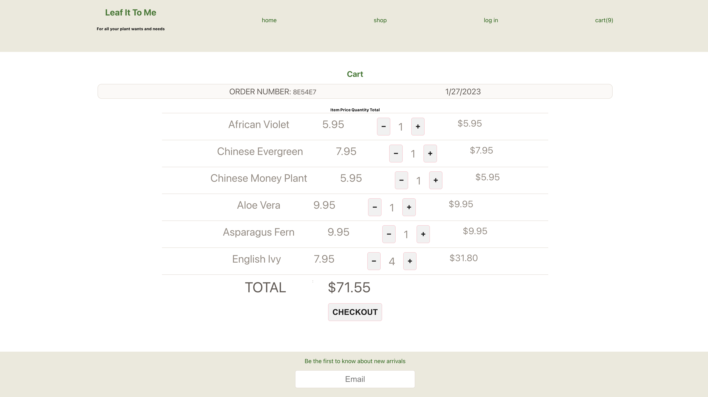

# FLORA GO

Flora Go is an online plant shop that provides users with a wide variety of plants to explore and purchase through a shopping cart system. Built using the MERN stack, it offers a user-friendly interface and including secure user authentication through the use of JWT tokens. Users can easily sign up, log in, and have their carts automatically saved, and additional features to be added to enhance the overall user experience. Leaf it to me is a destination for all plant enthusiasts. 

# First Look 

### Landing Page
 

### Shop Page

### Cart Page

## Technology Used
- MongoDB Atlas Cloud Database
- React
- Express
- NodeJS
- Deployed on Heroku App

## Getting Started

Repo: [FLORA GO](https://github.com/bholeneha/florago)

Deployed here: [FLORA GO](https://leafittome.herokuapp.com/)

Explore the shop by clicking navigating to shop in nav bar from the landing page. Add and remove items to and from cart. Signup and create a user login to save cart.

## Next Steps 
- Add wishlist feature
- Improve styling and user interface
- Make it responsive
- Add details page for products
- Add keyword search
- Create a profile page
- Add admin functionality to add and update new products